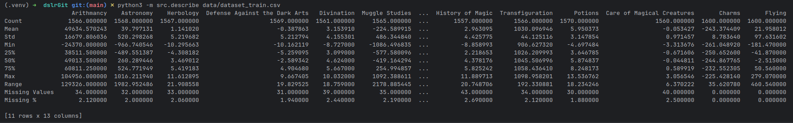
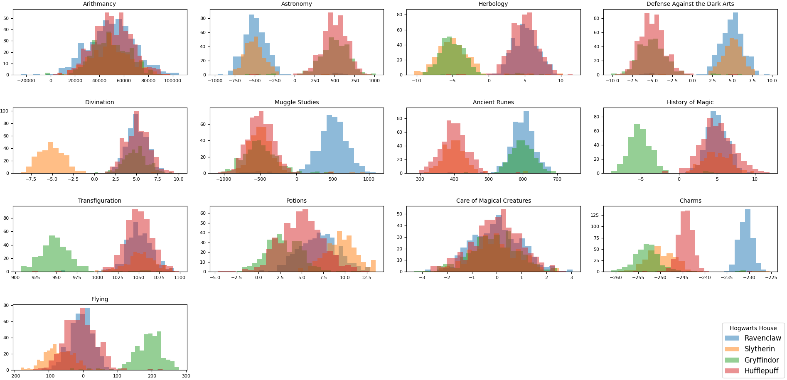
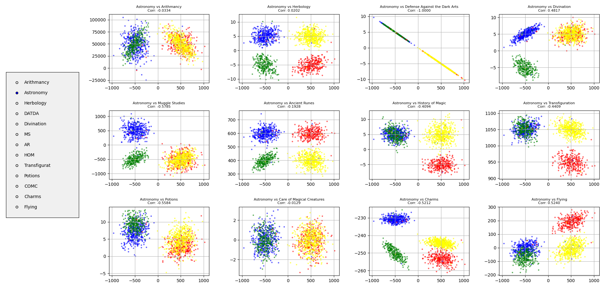
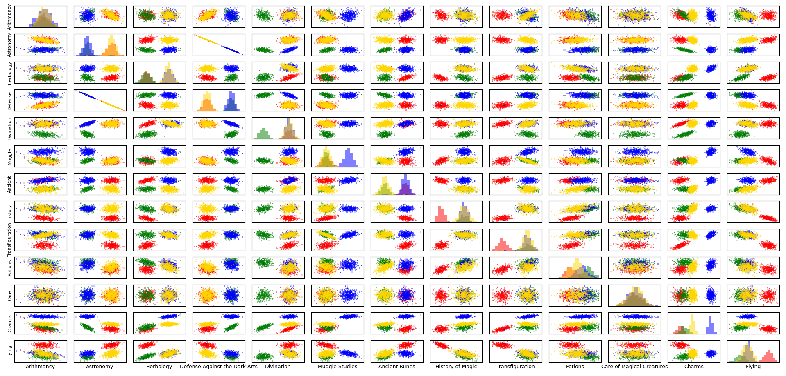

<div align="center">

# dslr

**Write a classifier and save Hogwarts!**

</div>

## Installation

1. Clone the repository:

```bash
git clone https://github.com/lanceleau02/dslr.git
```

2. Navigate to the project directory:

```bash
cd dslr
```

3. Create and install the virtual environment:

```bash
python3 -m venv venv
source venv/bin/activate
```

## Requirements

The project uses the following libraries:

- `numpy`: For matrix calculations.
- `pandas`: For data manipulation and analysis.
- `matplotlib` & `seaborn`: For data visualization.

You can install them using:

```bash
pip install -r requirements.txt
```

## Usage

### 1. Data Analysis

To see the statistical summary of the dataset:

```bash
python3 -m src.describe data/dataset_train.csv
```

### 2. Data Visualization

Explore the dataset through various plots:

```bash
# Distribution of scores
python3 -m src.histogram data/dataset_train.csv

# Similarities between features
python3 -m src.scatter_plot data/dataset_train.csv

# Global overview
python3 -m src.pair_plot data/dataset_train.csv
```

### 3. Training the Model

Train the Mechanical Sorting Hat using Logistic Regression:

```bash
# Default Batch Gradient Descent
python3 -m src.logreg_train data/dataset_train.csv

# Other methods: minibatch or stochastic
python3 -m src.logreg_train data/dataset_train.csv --method stochastic
```

### 4. Predicting Houses

Sort new students into their houses:

```bash
python3 -m src.logreg_predict data/dataset_test.csv
```

## Subject Breakdown

This project introduces machine learning by implementing a **logistic regression** model from scratch. The goal is to
predict **which Hogwarts house a student belongs to based on their magical subject scores** using a dataset of past
students. It consists of several key scripts: `src/describe.py` to calculate statistical information about the dataset,
visualization scripts (`src/histogram.py`, `src/scatter_plot.py`, `src/pair_plot.py`) to explore the data and select the
best
features, `src/logreg_train.py` to train the model, and finally, `src/logreg_predict.py` to sort new students into their
respective houses based on the trained weights.

At its core, the model finds patterns in multidimensional data: certain combinations of grades (like high scores in
Potions or Astronomy) strongly correlate with specific houses. Instead of manually writing conditional rules to sort the
students, the model learns the mathematical boundaries between the four houses, then uses those learned relationships to
classify new students.

The process starts with analyzing and visualizing the dataset to identify which magical subjects are actually useful for
separating the students. Then, using a "One-vs-All" strategy and **gradient descent**, the model adjusts its parameters
to minimize classification errors across four separate binary classifiers (e.g., Gryffindor vs. Not Gryffindor). Once
trained, the model calculates the probability of a new student belonging to each house and assigns them to the highest
match. This project covers the essential steps of data exploration, feature scaling, and multi-class classification,
introducing fundamental data science concepts used in more complex machine learning pipelines.

## Understand the goal

To truly understand what we need to build, we are going to look at it not as a Python script, but as a magical factory.
The goal was to build a Mechanical Sorting Hat. Because computers cannot read minds, the mechanical hat has to rely
entirely on math and historical data (the student's grades).

### Phase 1: The Admissions Office (Data Preprocessing)

Before the Mechanical Sorting Hat can even look at a student, the raw paperwork has to be perfectly organized.

* **The Problem:** The raw CSV file is a mess. Some students missed exams (NaNs), and the grading scales are completely
  wild. Astronomy is graded on a scale of -1000 to 1000, while Potions is graded from 0 to 10. If we feed this directly
  to the machine, it will assume Astronomy is infinitely more important just because the numbers are bigger.
* **The Solution (Imputation & Scaling):**
    * First, we fill in the blank test scores with the class average (`fillna`).
    * Then, we send the grades through **The Great Equalizer** (Z-Score Standardization). We subtract the mean ($\mu$)
      and divide by the standard deviation ($\sigma$).
* **The Metaphor:** Imagine taking every student's test score and translating it into a universal "Z-Language". A `0`
  means you are perfectly average. A `1.5` means you are above average. Now, an outstanding Potions grade and an
  outstanding Astronomy grade look exactly the same to the machine.
* **The Golden Rule:** We lock the $\mu$ and $\sigma$ blueprints in a safe (`data/model.json`). When new students
  arrive next year, we MUST judge them using these exact same standards, or the whole system breaks.

### Phase 2: The Mechanical Brain (Core Math Helpers)

Next, we built the three mechanical gears that allow the machine to actually "think" and learn from its mistakes.

**1. The Probability Lens (`sigmoid`)**
Linear regression outputs raw, wild numbers (like $z = 450$). But we need a percentage chance (from $0$ to $1$). The
Sigmoid function is a magical lens. No matter how massive or negative a number you push through it, it squashes it into
a neat probability. (e.g., $0.85$ means an 85% chance of being in Gryffindor).

**2. The Guilt-O-Meter (`compute_cost` / Log Loss)**
The machine needs to know when it messes up. If it looks at Harry Potter, predicts he is 99% likely to be a Slytherin,
and then checks the answer key and sees he is actually a Gryffindor, the Guilt-O-Meter penalizes it massively. It
calculates the mathematical distance between the machine's *guesses* and the *actual truth*.

**3. The Blindfolded Hiker (`gradient_descent`)**
This is how the machine learns.

* **The Metaphor:** Imagine the machine is blindfolded, standing on the side of a massive crater. The bottom of the
  crater represents perfect accuracy (zero error).
* It takes a guess (calculates probabilities).
* It checks the Guilt-O-Meter to see its altitude.
* It feels the ground with its foot to find the slope (calculating the **Gradient** using matrix multiplication).
* It takes a step downhill (the size of the step is your **Learning Rate**, $\alpha$).
* It repeats this 1,000 times until it reaches the flat bottom of the crater. The coordinates of the bottom are your
  perfect $\theta$ weights!

### Phase 3: The Four Bouncers (One-vs-All Training)

Here is the biggest secret of Logistic Regression: **It can only answer Yes or No.** It cannot pick between four houses.
So, how did we solve this?

* **The Metaphor:** Instead of building one omniscient Sorting Hat, we hired **Four Specialized Bouncers**.
    * We train Bouncer 1 to only care about one thing: *"Are you a Gryffindor, YES or NO?"* (All other houses are
      grouped into "No").
    * We train Bouncer 2: *"Are you a Slytherin, YES or NO?"*
    * Bouncer 3 looks for Ravenclaws.
    * Bouncer 4 looks for Hufflepuffs.
* **The Code:** We loop through the four houses. For each house, we set up our blindfolded hiker, run gradient descent
  1,000 times, and find the perfect weights for that specific bouncer. We then write down all four sets of weights in
  our ledger (`weights_data.json`).

### Phase 4: The Final Exam (Prediction)

The training is over. It is time to test the machine on brand new students (`dataset_test.csv`) who do not have a house
assigned to them yet.

* **Step 1 - The Equalizer Returns:** The new students walk in. We immediately open our safe, pull out last year's
  `scaling_params.json`, and translate their grades into the universal Z-Language so the machine can understand them.
* **Step 2 - The Interview Panel:** The student stands in front of the Four Bouncers.
    * The Gryffindor bouncer looks at the grades, applies his weights, and says: *"I am 20% sure this is a Gryffindor."*
    * The Slytherin bouncer says: *"I am 85% sure this is a Slytherin."*
    * The Ravenclaw bouncer says: *"I am 10% sure."*
    * The Hufflepuff bouncer says: *"I am 2% sure."*
* **Step 3 - The Verdict:** Using Pandas' `idxmax()`, the machine simply points to the bouncer who shouted the highest
  number. The student is branded a house, written into `data/houses.csv`, and sent to their common room.

## Implementation of data analysis

Our data analysis tool provides a statistical summary of the dataset, similar to Pandas' `describe` method, but
implemented using our custom math utilities.

### The `describe` Function



This function calculates key metrics like mean, standard deviation, and quartiles for every numeric feature in the
dataset.

```python
def describe(dataset):
    # 1. Filter out the 'Index' column and initialize results
    df = dataset.loc[:, dataset.columns != 'Index']
    stats = {}
    for col in df.columns:
        # 2. Skip non-numeric columns
        if df[col].dtype not in [np.float64, np.int64]:
            continue
        # 3. Handle missing values (NaNs)
        data = df[col].dropna().values
        # 4. Sort data for percentile calculations
        sorted_data = sort_(data)
        # 5. Calculate metrics using custom math utilities
        stats[col] = {
            "Count":          n,
            "Mean":           mean_(data),
            "Std":            std_(data),
            "Min":            min_(data),
            "25%":            percentile_(sorted_data, 0.25),
            "50%":            percentile_(sorted_data, 0.50),
            "75%":            percentile_(sorted_data, 0.75),
            "Max":            max_(data),
            "Range":          range_(data),
            "Missing Values": missing_count,
            "Missing %":      round(missing_count / total_count * 100, 2),
        }
    print(pd.DataFrame(stats))
```

The `describe` function is the first step in our pipeline. It iterates through all columns, ignoring the `Index` and any
non-numeric data. For each valid column, it drops any `NaN` values to ensure the math stays accurate. A crucial step is
calling `sort_(data)` before calculating percentiles, as our `percentile_` utility requires an ordered list to find the
correct values for the 25th, 50th (median), and 75th percentiles. Finally, it formats all these metrics into a clean,
readable table using a Pandas DataFrame.

## Implementation of vizualization

Our data visualization tools help us understand the relationships between magical subjects and Hogwarts houses.

### Histograms



We use histograms to see the distribution of scores for each house across all subjects. This helps identify which
subjects have distinct distributions for different houses.

```python
def plot_histogram(df, feature, ax):
    # Get unique houses and remove missing values
    houses = df['Hogwarts House'].dropna().unique()
    for house in houses:
        # Filter data for each specific house and current feature
        house_data = df[df['Hogwarts House'] == house][feature].dropna()
        # Plot overlapping histograms with 50% transparency (alpha=0.5)
        ax.hist(house_data, bins=25, alpha=0.5, label=house)
    ax.set_title(feature)
```

The `plot_histogram` function iterates through each house and filters the DataFrame for the scores related to that house
for a specific subject. By setting `alpha=0.5`, we allow the distributions to overlap, making it easier to see which
subjects have distinct "fingerprints" for different houses.

### Scatter Plots



Scatter plots allow us to compare two subjects at once. By looking at the correlation between subjects, we can identify
redundant features (those that are highly correlated).

```python
def scatter_plot(df, feature1, feature2, ax):
    houses = df['Hogwarts House'].unique()
    colors = {'Gryffindor': 'red', 'Slytherin': 'green', 'Hufflepuff': 'yellow', 'Ravenclaw': 'blue'}
    for house in houses:
        # Isolate house-specific data points
        house_data = df[df['Hogwarts House'] == house]
        # Plot points with small size and custom colors for better visibility
        ax.scatter(house_data[feature1], house_data[feature2], alpha=0.5, label=house, color=colors[house])
```

The `scatter_plot` implementation maps each house to a specific color. This visualization is crucial for identifying
linear relationships between subjects. If two subjects show a tight diagonal line, they are highly correlated and
potentially redundant for our model.

### Pair Plots



The pair plot is our most powerful tool, providing a global overview of all subject interactions and distributions in a
single grid.

```python
def pair_plot(data):
    # Diagonal: Histograms
    # Off-diagonal: Scatter plots
    num_features = len(course)
    fig, axs = plt.subplots(num_features, num_features)
    # ... logic to plot histograms on i==j and scatter otherwise ...
```

In the full implementation, the `pair_plot` uses a nested loop `(i, j)` to create a grid. When `i == j`, it calls
`ax.hist` to show the feature's distribution. When `i != j`, it calls `ax.scatter` to show the relationship between two
different features. This allows for a comprehensive "at-a-glance" analysis of the entire dataset.

## Implementation of logistic regression

The core of our machine learning model is built from scratch using NumPy.

### 1. The Sigmoid Function

Maps any input into a probability between 0 and 1.

```python
def sigmoid(z):
    # np.clip prevents math overflow errors with large exponents
    z = np.clip(z, -500, 500)
    # The standard logistic formula
    return 1 / (1 + np.exp(-z))
```

The `sigmoid` function is the core of logistic regression. We use `np.clip` to ensure that `np.exp(-z)` doesn't overflow
or underflow, which would lead to `NaN` values. This function ensures our output is always between $0$ and $1$,
representing the probability of a class.

### 2. The Cost Function (Log Loss)

Measures how well our model is performing by penalizing incorrect predictions.

```python
def compute_cost(X, y, theta):
    m = len(y)
    # Calculate hypothesis (predicted probabilities)
    h = sigmoid(np.dot(X, theta))
    # Epsilon prevents log(0) which would return negative infinity
    epsilon = 1e-15
    # Binary Cross-Entropy formula
    return -(1 / m) * np.sum(y * np.log(h + epsilon) + (1 - y) * np.log(1 - h + epsilon))
```

The `compute_cost` function implements **Log Loss**. It calculates the dot product of our features `X` and weights
`theta` to get raw scores, transforms them with `sigmoid`, and then measures the error. The `epsilon` term is a small
constant added to the log to avoid mathematical errors when the prediction is exactly $0$ or $1$.

### 3. Gradient Descent

The optimization algorithm that adjusts our weights (`theta`) to minimize the cost.

```python
def gradient_descent(X, y, theta, alpha, iterations):
    m = len(X)
    for _ in range(iterations):
        # 1. Get current predictions
        H = sigmoid(X.dot(theta))
        # 2. Calculate the error (difference between prediction and reality)
        # 3. Compute the gradient (the direction and magnitude of the change)
        gradient = np.dot(((1 / m) * X.transpose()), (H - y))
        # 4. Update weights (move in the opposite direction of the gradient)
        theta -= alpha * gradient
    return theta
```

`gradient_descent` is where the learning happens. In each iteration, we calculate the `gradient`, which represents the
partial derivative of the cost function with respect to our weights. We then subtract a fraction of this gradient (
defined by the learning rate `alpha`) from our current `theta` to move toward the minimum cost.

## License

This project is licensed under the **42 School** License.

- **Educational Use Only**: This project is intended for educational purposes at the 42 School as part of the
  curriculum.
- **Non-commercial Use**: The code may not be used for commercial purposes or redistributed outside of the 42 School
  context.
- **No Warranty**: The project is provided "as-is", without any warranty of any kind.

For more details, see the [LICENSE](https://github.com/lanceleau02/dslr/blob/main/LICENSE) file.